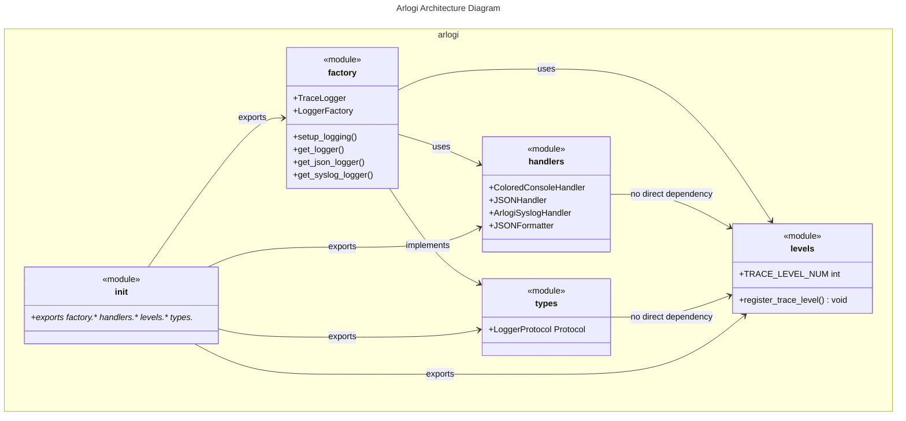

# C4 Code Level: `arlogi`

## Overview

- **Name**: `arlogi` Logging Library Core
- **Description**: Core logging library with custom TRACE level, colored console output, JSON logging, and syslog support
- **Location**: [src/arlogi](../src/arlogi/)
- **Language**: Python 3.13+
- **Purpose**: Provides enhanced logging functionality with colored output, structured JSON logging, custom trace levels, and caller attribution features

## Code Elements

### Classes

#### `TraceLogger` (factory.py:11-109)

- **Description**: Custom logger class with TRACE level support and caller attribution functionality
- **Location**: [src/arlogi/factory.py:11](../src/arlogi/factory.py:11)
- **Methods**:
  - `_get_caller_info(depth: int) -> tuple[str, str]`
    - Description: Retrieves module name and function name at specified stack depth
    - Location: [src/arlogi/factory.py:14](../src/arlogi/factory.py:14)
    - Dependencies: `sys` module
  - `_handle_from_caller(msg: Any, kwargs: dict[str, Any]) -> Any`
    - Description: Processes `from_caller` parameter and appends caller attribution to message
    - Location: [src/arlogi/factory.py:31](../src/arlogi/factory.py:31)
    - Dependencies: `rich.markup.escape`, `levels.TRACE_LEVEL_NUM`
  - `trace(msg: Any, *args: Any, **kwargs: Any) -> None`
    - Description: Logs message with custom TRACE level (level 5)
    - Location: [src/arlogi/factory.py:74](../src/arlogi/factory.py:74)
    - Dependencies: Internal `_handle_from_caller`, `levels.TRACE_LEVEL_NUM`
  - `debug(msg: Any, *args: Any, **kwargs: Any) -> None`
    - Description: Logs debug message with caller attribution
    - Location: [src/arlogi/factory.py:82](../src/arlogi/factory.py:82)
    - Dependencies: Internal `_handle_from_caller`
  - `info(msg: Any, *args: Any, **kwargs: Any) -> None`
    - Description: Logs info message with caller attribution
    - Location: [src/arlogi/factory.py:86](../src/arlogi/factory.py:86)
    - Dependencies: Internal `_handle_from_caller`
  - `warning(msg: Any, *args: Any, **kwargs: Any) -> None`
    - Description: Logs warning message with caller attribution
    - Location: [src/arlogi/factory.py:90](../src/arlogi/factory.py:90)
    - Dependencies: Internal `_handle_from_caller`
  - `error(msg: Any, *args: Any, **kwargs: Any) -> None`
    - Description: Logs error message with caller attribution
    - Location: [src/arlogi/factory.py:94](../src/arlogi/factory.py:94)
    - Dependencies: Internal `_handle_from_caller`
  - `critical(msg: Any, *args: Any, **kwargs: Any) -> None`
    - Description: Logs critical message with caller attribution
    - Location: [src/arlogi/factory.py:98](../src/arlogi/factory.py:98)
    - Dependencies: Internal `_handle_from_caller`
  - `exception(msg: Any, *args: Any, **kwargs: Any) -> None`
    - Description: Logs exception message with caller attribution
    - Location: [src/arlogi/factory.py:102](../src/arlogi/factory.py:102)
    - Dependencies: Internal `_handle_from_caller`
  - `log(level: int, msg: Any, *args: Any, **kwargs: Any) -> None`
    - Description: Generic logging method with caller attribution
    - Location: [src/arlogi/factory.py:106](../src/arlogi/factory.py:106)
    - Dependencies: Internal `_handle_from_caller`
- **Dependencies**: `sys`, `rich.markup.escape`, `levels.TRACE_LEVEL_NUM`, `types.LoggerProtocol`

#### `LoggerFactory` (factory.py:111-222)

- **Description**: Factory class for creating and managing logger instances with centralized configuration
- **Location**: [src/arlogi/factory.py:111](../src/arlogi/factory.py:111)
- **Methods**:
  - `setup(level: int | str = logging.INFO, module_levels: dict[str, str | int] | None = None, json_file_name: str | None = None, json_file_only: bool = False, use_syslog: bool = False, syslog_address: str | tuple[str, int] = "/dev/log", show_time: bool = False, show_level: bool = True, show_path: bool = True) -> None`
    - Description: Centralized logging setup configuration method
    - Location: [src/arlogi/factory.py:130](../src/arlogi/factory.py:130)
    - Dependencies: `logging`, `handlers.*`, `levels.register_trace_level`, `types.LoggerProtocol`
  - `is_test_mode() -> bool`
    - Description: Detects if running under test environment (pytest/unittest)
    - Location: [src/arlogi/factory.py:175](../src/arlogi/factory.py:175)
    - Dependencies: `sys`, `os`
  - `get_logger(name: str, level: int | str | None = None) -> LoggerProtocol`
    - Description: Creates or returns a logger instance with optional level override
    - Location: [src/arlogi/factory.py:184](../src/arlogi/factory.py:184)
    - Dependencies: `logging`, internal `setup` method
  - `get_json_logger(name: str = "json", json_file_name: str | None = None) -> LoggerProtocol`
    - Description: Creates a dedicated JSON logger that bypasses root handlers
    - Location: [src/arlogi/factory.py:221](../src/arlogi/factory.py:221)
    - Dependencies: `logging`, `handlers.JSONHandler`, `handlers.JSONFileHandler`
  - `get_syslog_logger(name: str = "syslog", address: str | tuple[str, int] = "/dev/log") -> LoggerProtocol`
    - Description: Creates a dedicated syslog logger that bypasses root handlers
    - Location: [src/arlogi/factory.py:233](../src/arlogi/factory.py:233)
    - Dependencies: `logging`, `handlers.ArlogiSyslogHandler`
  - `get_global_logger() -> LoggerProtocol`
    - Description: Returns or initializes the global singleton logger instance
    - Location: [src/arlogi/factory.py:244](../src/arlogi/factory.py:244)
    - Dependencies: Internal `get_logger` method
- **Dependencies**: `logging`, `handlers.*`, `levels.register_trace_level`, `types.LoggerProtocol`, `sys`, `os`

#### `ColoredConsoleHandler` (handlers.py:12-77)

- **Description**: Rich-based colored console handler with customizable styling
- **Location**: [src/arlogi/handlers.py:12](../src/arlogi/handlers.py:12)
- **Methods**:
  - `__init__(show_time: bool = False, show_level: bool = True, show_path: bool = True, level_styles: dict[str, str] | None = None, *args: Any, **kwargs: Any)`
    - Description: Initializes with default or custom styling options
    - Location: [src/arlogi/handlers.py:15](../src/arlogi/handlers.py:15)
    - Dependencies: `logging`, `rich.console.Console`, `rich.logging.RichHandler`
  - `get_level_text(record: logging.LogRecord) -> Any`
    - Description: Returns single-character level indicator with styling
    - Location: [src/arlogi/handlers.py:55](../src/arlogi/handlers.py:55)
    - Dependencies: `rich.text.Text`
  - `render_message(record: logging.LogRecord, message: str) -> Any`
    - Description: Applies level-specific styling to rendered message
    - Location: [src/arlogi/handlers.py:67](../src/arlogi/handlers.py:67)
    - Dependencies: `rich` module
- **Dependencies**: `logging`, `rich.console`, `rich.logging.RichHandler`, `rich.text.Text`

#### `JSONFormatter` (handlers.py:79-112)

- **Description**: JSON formatter for structured log output with rich metadata
- **Location**: [src/arlogi/handlers.py:79](../src/arlogi/handlers.py:79)
- **Methods**:
  - `format(record: logging.LogRecord) -> str`
    - Description: Formats log record as JSON with timestamp, level, and additional metadata
    - Location: [src/arlogi/handlers.py:82](../src/arlogi/handlers.py:82)
    - Dependencies: `json`, `datetime`, `logging.LogRecord`
- **Dependencies**: `json`, `datetime`, `logging.LogRecord`

#### `JSONHandler` (handlers.py:115-121)

- **Description**: Stream handler that outputs logs as JSON using custom formatter
- **Location**: [src/arlogi/handlers.py:115](../src/arlogi/handlers.py:115)
- **Methods**:
  - `__init__(stream: Any = None)`
    - Description: Initializes with optional stream and sets JSON formatter
    - Location: [src/arlogi/handlers.py:118](../src/arlogi/handlers.py:118)
    - Dependencies: `logging.StreamHandler`, `handlers.JSONFormatter`
- **Dependencies**: `logging.StreamHandler`, `handlers.JSONFormatter`

#### `ArlogiSyslogHandler` (handlers.py:123-147)

- **Description**: Robust syslog handler with fallback support for different platforms
- **Location**: [src/arlogi/handlers.py:123](../src/arlogi/handlers.py:123)
- **Methods**:
  - `__init__(address: str | tuple[str, int] = "/dev/log", facility: int | str = logging.handlers.SysLogHandler.LOG_USER, socktype: int | None = None)`
    - Description: Initializes syslog handler with platform-specific fallback logic
    - Location: [src/arlogi/handlers.py:126](../src/arlogi/handlers.py:126)
    - Dependencies: `logging.handlers.SysLogHandler`
- **Dependencies**: `logging.handlers.SysLogHandler`

#### `LoggerProtocol` (types.py:5-24)

- **Description**: Protocol defining the interface for arlogi logger implementations
- **Location**: [src/arlogi/types.py:5](../src/arlogi/types.py:5)
- **Methods**:
  - `trace(msg: Any, *args: Any, from_caller: int | None = None, from_: int | None = None, **kwargs: Any) -> None`
  - `debug(msg: Any, *args: Any, from_caller: int | None = None, from_: int | None = None, **kwargs: Any) -> None`
  - `info(msg: Any, *args: Any, from_caller: int | None = None, from_: int | None = None, **kwargs: Any) -> None`
  - `warning(msg: Any, *args: Any, from_caller: int | None = None, from_: int | None = None, **kwargs: Any) -> None`
  - `error(msg: Any, *args: Any, from_caller: int | None = None, from_: int | None = None, **kwargs: Any) -> None`
  - `critical(msg: Any, *args: Any, from_caller: int | None = None, from_: int | None = None, **kwargs: Any) -> None`
  - `fatal(msg: Any, *args: Any, from_caller: int | None = None, from_: int | None = None, **kwargs: Any) -> None`
  - `exception(msg: Any, *args: Any, from_caller: int | None = None, from_: int | None = None, **kwargs: Any) -> None`
  - `log(level: int, msg: Any, *args: Any, from_caller: int | None = None, from_: int | None = None, **kwargs: Any) -> None`
  - `setLevel(level: int | str) -> None`
  - `isEnabledFor(level: int) -> bool`
  - `getEffectiveLevel() -> int`
- **Properties**: `name: str`
- **Dependencies**: `typing`, Protocol interface

### Functions

#### `register_trace_level()` (levels.py:7-21)

- **Description**: Registers custom TRACE level (level 5) with Python's logging module
- **Location**: [src/arlogi/levels.py:7](../src/arlogi/levels.py:7)
- **Dependencies**: `logging`
- **Side Effects**: Modifies `logging` module by adding `TRACE` level and `trace` method

#### `setup_logging()` (factory.py:251-273)

- **Description**: Helper function to configure arlogi with common options
- **Location**: [src/arlogi/factory.py:251](../src/arlogi/factory.py:251)
- **Dependencies**: `LoggerFactory.setup`
- **Parameters**:
  - `level: int | str = logging.INFO` - Default logging level
  - `module_levels: dict[str, str | int] | None = None` - Per-module logging levels
  - `json_file_name: str | None = None` - JSON log file path (None for no file output)
  - `json_file_only: bool = False` - If True, only JSON output (no console)
  - `use_syslog: bool = False` - Enable syslog output
  - `syslog_address: str | tuple[str, int] = "/dev/log"` - Syslog server address
  - `show_time: bool = False` - Show timestamps in console output
  - `show_level: bool = True` - Show log levels in console output
  - `show_path: bool = True` - Show file paths in console output

#### `get_logger()` (factory.py:276-278)

- **Description**: Helper function to get a logger instance
- **Location**: [src/arlogi/factory.py:276](../src/arlogi/factory.py:276)
- **Dependencies**: `LoggerFactory.get_logger`

#### `get_json_logger()` (factory.py:281-283)

- **Description**: Helper function to get a dedicated JSON logger
- **Location**: [src/arlogi/factory.py:281](../src/arlogi/factory.py:281)
- **Dependencies**: `LoggerFactory.get_json_logger`
- **Parameters**:
  - `name: str = "json"` - Logger name
  - `json_file_name: str | None = None` - JSON log file path (None for stdout)

#### `get_syslog_logger()` (factory.py:286-290)

- **Description**: Helper function to get a dedicated syslog logger
- **Location**: [src/arlogi/factory.py:286](../src/arlogi/factory.py:286)
- **Dependencies**: `LoggerFactory.get_syslog_logger`

## Dependencies

### Internal Dependencies

- **factory.py**:
  - Depends on `handlers.py` for `ArlogiSyslogHandler`, `ColoredConsoleHandler`, `JSONHandler`, `JSONFileHandler`
  - Depends on `levels.py` for `TRACE_LEVEL_NUM` and `register_trace_level`
  - Depends on `types.py` for `LoggerProtocol`
- **handlers.py**:
  - No internal dependencies (uses standard `logging` and external `rich` library)
- **levels.py**:
  - No internal dependencies (uses standard `logging`)
- **types.py**:
  - No internal dependencies (uses `typing` module)
- \***\*init**.py\*\*:
  - Exports functions from `factory.py`, `levels.py`, and `types.py`

### External Dependencies

- **rich>=14.2.0**: Used for colored console output, styled text, and rich tracebacks
- **standard library modules**:
  - `logging`: Core Python logging functionality
  - `json`: JSON formatting support
  - `datetime`: Timestamp formatting
  - `sys`: System utilities and stack inspection
  - `os`: Environment variable checking
  - `logging.handlers`: Syslog handler implementation

## Relationships

The `arlogi` library follows a clear modular architecture with distinct responsibilities:

Key architectural relationships:

1. **factory.py** is the core module containing the main `TraceLogger` and `LoggerFactory` classes
2. **handlers.py** provides output formatters and handlers for different log destinations
3. **levels.py** defines the custom TRACE level and registers it with Python's logging
4. **types.py** defines the `LoggerProtocol` interface that all loggers implement
5. \***\*init**.py\*\* serves as the public API, exposing all major components

The design follows separation of concerns with clear dependencies flowing from the core logging functionality through to specific output handlers.
