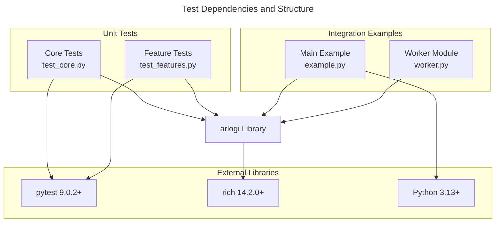

# C4 Code Level: tests

## Overview

- **Name**: Test Suite
- **Description**: Comprehensive test suite for the arlogi logging library
- **Location**: `/opt/Code/2026/_Libs/arlogi/tests/`
- **Language**: Python 3.13+
- **Purpose**: Validates the functionality of the arlogi logging library including core features, custom logging levels, JSON logging, module-specific levels, and caller attribution

## Code Elements

### Functions/Methods

#### test_core.py

- `test_trace_level_registered() -> None`
  - Description: Tests that the custom TRACE level is properly registered with the logging system
  - Location: `/opt/Code/2026/_Libs/arlogi/tests/test_core.py:6`
  - Dependencies: `arlogi.TRACE`, `arlogi.get_logger`, `logging.getLevelName`

- `test_protocol_compliance() -> None`
  - Description: Verifies that the logger returned by get_logger implements the LoggerProtocol interface
  - Location: `/opt/Code/2026/_Libs/arlogi/tests/test_core.py:11`
  - Dependencies: `arlogi.LoggerProtocol`, `arlogi.get_logger`

- `test_test_mode_detection() -> None`
  - Description: Tests that the LoggerFactory correctly detects when running in test mode
  - Location: `/opt/Code/2026/_Libs/arlogi/tests/test_core.py:15`
  - Dependencies: `arlogi.factory.LoggerFactory.is_test_mode`

- `test_logging_calls(caplog: pytest.LogCaptureFixture) -> None`
  - Description: Tests that logging calls at various levels (TRACE, DEBUG, INFO) are properly captured and logged
  - Location: `/opt/Code/2026/_Libs/arlogi/tests/test_core.py:19`
  - Dependencies: `arlogi.TRACE`, `arlogi.get_logger`, `pytest.caplog`

#### test_features.py

- `test_module_specific_levels() -> None`
  - Description: Tests the ability to set different log levels for different modules/submodules
  - Location: `/opt/Code/2026/_Libs/arlogi/tests/test_features.py:7`
  - Dependencies: `arlogi.TRACE`, `arlogi.get_logger`, `arlogi.setup_logging`, `logging`

- `test_json_logger(capsys: pytest.CaptureFixture[str]) -> None`
  - Description: Tests the JSON logger functionality that outputs structured log data in JSON format
  - Location: `/opt/Code/2026/_Libs/arlogi/tests/test_features.py:27`
  - Dependencies: `json`, `arlogi.TRACE`, `arlogi.get_json_logger`, `pytest.capsys`

- `test_trace_stacklevel(caplog: pytest.LogCaptureFixture) -> None`
  - Description: Tests that the TRACE level correctly handles stack level attribution for accurate function name reporting
  - Location: `/opt/Code/2026/_Libs/arlogi/tests/test_features.py:46`
  - Dependencies: `arlogi.TRACE`, `arlogi.get_logger`, `pytest.caplog`

- `test_caller_attribution(caplog: pytest.LogCaptureFixture) -> None`
  - Description: Tests the caller attribution feature that shows which function called the logger
  - Location: `/opt/Code/2026/_Libs/arlogi/tests/test_features.py:55`
  - Dependencies: `logging`, `arlogi.get_logger`, `pytest.caplog`

#### example/example.py

- `main() -> None`
  - Description: Demonstrates comprehensive usage of the arlogi library including environment variable configuration, module-specific logging, dedicated loggers, and caller attribution
  - Location: `/opt/Code/2026/_Libs/arlogi/tests/example/example.py:8`
  - Dependencies: `os`, `worker`, `arlogi.TRACE`, `arlogi.get_json_logger`, `arlogi.get_logger`, `arlogi.get_syslog_logger`, `arlogi.setup_logging`

#### example/worker.py

- `do_work(depth: int = 0) -> None`
  - Description: Worker function that demonstrates cross-module caller attribution with different depth levels
  - Location: `/opt/Code/2026/_Libs/arlogi/tests/example/worker.py:5`
  - Dependencies: `arlogi.get_logger`

### Classes/Modules

#### test_core.py

- **Module**: `test_core`
  - Description: Core functionality tests for the arlogi logging library
  - Location: `/opt/Code/2026/_Libs/arlogi/tests/test_core.py`
  - Functions: `test_trace_level_registered`, `test_protocol_compliance`, `test_test_mode_detection`, `test_logging_calls`
  - Dependencies: `logging`, `arlogi` (TRACE, LoggerProtocol, get_logger)

#### test_features.py

- **Module**: `test_features`
  - Description: Advanced feature tests for the arlogi logging library
  - Location: `/opt/Code/2026/_Libs/arlogi/tests/test_features.py`
  - Functions: `test_module_specific_levels`, `test_json_logger`, `test_trace_stacklevel`, `test_caller_attribution`
  - Dependencies: `json`, `logging`, `arlogi` (TRACE, get_json_logger, get_logger, setup_logging)

#### example/example.py

- **Module**: `example`
  - Description: Comprehensive example demonstrating arlogi library usage
  - Location: `/opt/Code/2026/_Libs/arlogi/tests/example/example.py`
  - Functions: `main`
  - Dependencies: `os`, `worker`, `arlogi` (TRACE, get_json_logger, get_logger, get_syslog_logger, setup_logging)

#### example/worker.py

- **Module**: `worker`
  - Description: Worker module used in examples to demonstrate cross-module logging
  - Location: `/opt/Code/2026/_Libs/arlogi/tests/example/worker.py`
  - Functions: `do_work`
  - Dependencies: `arlogi.get_logger`

## Dependencies

### Internal Dependencies

- `arlogi` - The main logging library being tested
- `worker` - Local worker module in the example package
- `example` - Local example module package

### External Dependencies

- `pytest>=9.0.2` - Testing framework for running tests
- `pytest-catchlog` - Plugin for capturing log messages (likely part of pytest)
- `python>=3.13` - Python runtime environment
- `rich>=14.2.0` - Rich library for enhanced terminal output (used by arlogi)

## Relationships

## Notes

- The test suite is organized into core functionality tests and advanced feature tests
- Example code demonstrates practical usage patterns including environment variable configuration
- Cross-module testing validates that caller attribution works across different modules
- Tests cover both standard logging levels and the custom TRACE level
- JSON logging functionality is tested for structured output capability
- Module-specific logging levels ensure granular control over logging verbosity
