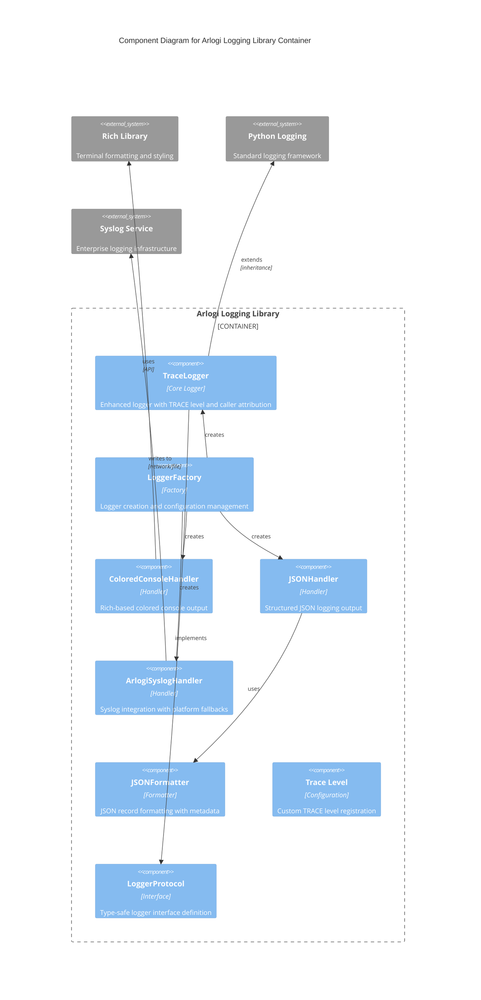

# C4 Component Level: `arlogi` Logging Library

## Overview

- **Name**: `arlogi` Enhanced Logging Library
- **Description**: Comprehensive Python logging library with custom TRACE level, colored console output, structured JSON logging, syslog support, and caller attribution features
- **Type**: Library
- **Technology**: Python 3.13+, Rich Terminal Library

## Purpose

The `arlogi` Logging Library is a sophisticated logging component that extends Python's standard logging functionality with enhanced features for modern application development. It solves several common logging challenges:

1. **Enhanced Visibility**: Provides a custom TRACE level (level 5) for fine-grained debugging that sits between standard logging levels
2. **Rich Console Output**: Delivers colored, formatted console output with the Rich library for improved readability
3. **Structured Logging**: Offers JSON-formatted logging for better integration with log aggregation systems
4. **Production Integration**: Includes syslog support for enterprise logging infrastructure
5. **Debugging Support**: Features caller attribution to trace the origin of log messages across function call stacks

The component serves as the central logging infrastructure for applications, providing a unified interface for all logging needs while maintaining compatibility with Python's standard logging module.

## Software Features

### Core Logging Features

- **Custom TRACE Level**: Level 5 logging capability for detailed debugging between standard levels
- **Logger Protocol Compliance**: Implements standardized logger interface for type safety and consistency
- **Caller Attribution**: Automatic function and module name attribution for log messages with configurable stack depth
- **Module-Specific Log Levels**: Granular control over logging verbosity per module or submodule

### Output Formats

- **Colored Console Output**: Rich terminal formatting with customizable styles, colors, and level indicators
- **Structured JSON Logging**: Machine-readable JSON output with timestamps, levels, and metadata
- **Syslog Integration**: Enterprise-grade syslog support with platform-specific fallbacks
- **Standard Logging Compatibility**: Full compatibility with Python's standard logging module

### Configuration Management

- **Centralized Setup**: Single method for configuring all logging aspects including levels, outputs, and formatting
- **Environment Variable Support**: Automatic detection of test environments (pytest/unittest)
- **Multiple Logger Types**: Support for standard, JSON-only, and syslog-only loggers
- **Flexible Factory Pattern**: Factory-based logger creation with singleton support for global logger instances

### Development Features

- **Protocol-Based Design**: Type-safe logger interfaces using Python's Protocol system
- **Rich Tracebacks**: Enhanced error reporting with rich-formatted tracebacks
- **Test Mode Detection**: Automatic adaptation for test environments
- **Comprehensive API**: Full set of logging methods (trace, debug, info, warning, error, critical, exception, fatal)

## Code Elements

This component contains the following code-level elements:

- [c4-code-src-arlogi.md](./c4-code-src-arlogi.md) - Core logging library implementation with main classes, handlers, and utility functions
- [c4-code-tests.md](./c4-code-tests.md) - Comprehensive test suite validating core functionality and advanced features
- [c4-code-tests-example.md](./c4-code-tests-example.md) - Example implementations demonstrating practical usage patterns and integration scenarios

## Interfaces

### LoggerProtocol Interface

- **Protocol**: Python Protocol Interface
- **Description**: Defines the standardized interface that all arlogi logger implementations must follow
- **Operations**:
  - `trace(msg: Any, *args: Any, from_caller: int | None = None, from_: int | None = None, **kwargs: Any) -> None`
  - `debug(msg: Any, *args: Any, from_caller: int | None = None, from_: int | None = None, **kwargs: Any) -> None`
  - `info(msg: Any, *args: Any, from_caller: int | None = None, from_: int | None = None, **kwargs: Any) -> None`
  - `warning(msg: Any, *args: Any, from_caller: int | None = None, from_: int | None = None, **kwargs: Any) -> None`
  - `error(msg: Any, *args: Any, from_caller: int | None = None, from_: int | None = None, **kwargs: Any) -> None`
  - `critical(msg: Any, *args: Any, from_caller: int | None = None, from_: int | None = None, **kwargs: Any) -> None`
  - `fatal(msg: Any, *args: Any, from_caller: int | None = None, from_: int | None = None, **kwargs: Any) -> None`
  - `exception(msg: Any, *args: Any, from_caller: int | None = None, from_: int | None = None, **kwargs: Any) -> None`
  - `log(level: int, msg: Any, *args: Any, from_caller: int | None = None, from_: int | None = None, **kwargs: Any) -> None`
  - `setLevel(level: int | str) -> None`
  - `isEnabledFor(level: int) -> bool`
  - `getEffectiveLevel() -> int`
  - `name: str` (property)

### LoggerFactory API

- **Protocol**: Factory Pattern API
- **Description**: Factory interface for creating and configuring logger instances
- **Operations**:
  - `setup(level: int | str, module_levels: dict[str, str | int] | None, json_file_name: str | None, json_file_only: bool, use_syslog: bool, syslog_address: str | tuple[str, int], show_time: bool, show_level: bool, show_path: bool) -> None`
  - `get_logger(name: str, level: int | str | None) -> LoggerProtocol`
  - `get_json_logger(name: str, json_file_name: str | None) -> LoggerProtocol`
  - `get_syslog_logger(name: str, address: str | tuple[str, int]) -> LoggerProtocol`
  - `get_global_logger() -> LoggerProtocol`
  - `is_test_mode() -> bool`

### Handler Interfaces

- **Protocol**: Python Logging Handler Interface
- **Description**: Various output handlers for different logging destinations
- **Operations**:
  - ColoredConsoleHandler: Rich-based console output with styling
  - JSONHandler: Stream handler for JSON-formatted output
  - JSONFileHandler: File handler for JSON-formatted output
  - ArlogiSyslogHandler: Syslog integration with platform fallbacks
  - JSONFormatter: JSON record formatting with metadata enrichment

## Dependencies

### External Libraries

- **Rich>=14.2.0**: Terminal formatting library used for colored console output, styled text, rich tracebacks, and enhanced visual presentation
- **Python Standard Library**:
  - `logging`: Core Python logging framework
  - `logging.handlers`: Syslog handler implementations
  - `json`: JSON serialization for structured logging
  - `datetime`: Timestamp formatting and metadata
  - `sys`: System utilities and stack inspection for caller attribution
  - `os`: Environment variable detection for test mode

### Python Runtime

- **Python 3.13+**: Runtime environment providing Protocol support and enhanced typing features

## Component Diagram

