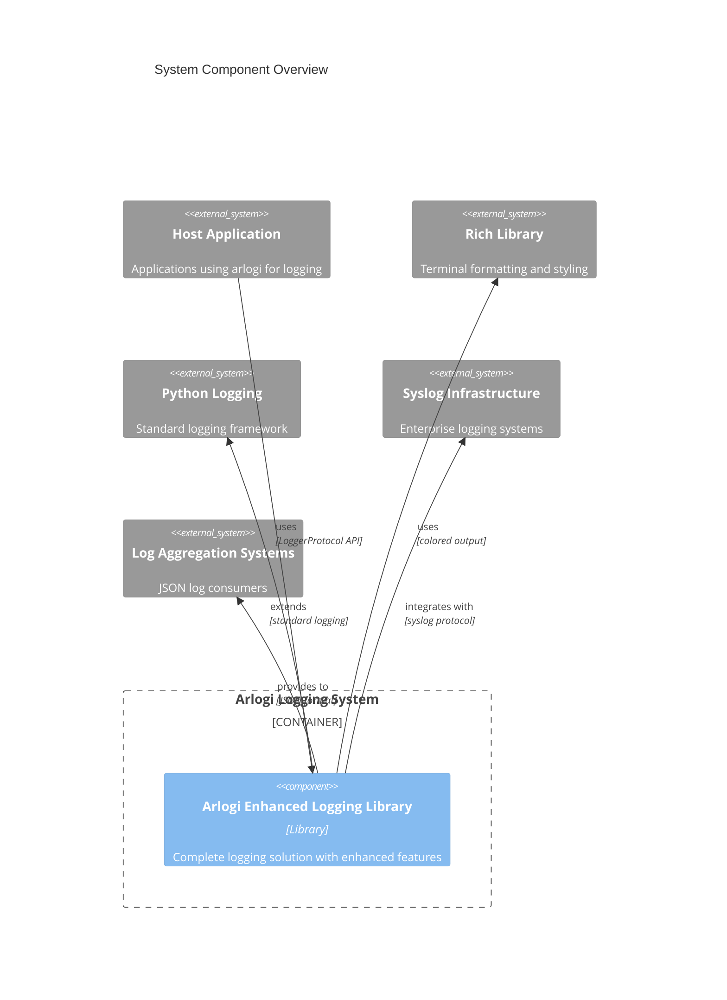

# C4 Component Level: System Overview

## System Components

### `arlogi` Enhanced Logging Library

- **Name**: `arlogi` Enhanced Logging Library
- **Description**: Comprehensive Python logging library with custom TRACE level, colored console output, structured JSON logging, syslog support, and caller attribution features
- **Documentation**: [c4-component-arlogi-logging-library.md](./c4-component-arlogi-logging-library.md)

## Component Relationships

## Summary

The `arlogi` system consists of a single, comprehensive component that provides enhanced logging capabilities for Python applications. This component serves as a complete logging solution that extends Python's standard logging framework with additional features for modern development needs.

### Key Features of the System:

- **Unified Logging Interface**: Single component providing all logging functionality
- **Enhanced Debugging**: Custom TRACE level and caller attribution
- **Multiple Output Formats**: Console, JSON, and syslog support
- **Production Ready**: Enterprise-grade logging with structured output
- **Developer Friendly**: Rich terminal formatting and comprehensive API

### System Architecture:

The system follows a monolithic component architecture where all logging functionality is encapsulated within the Arlogi Enhanced Logging Library. This design provides:

- **Simplified Integration**: Single dependency for all logging needs
- **Consistent Behavior**: Unified configuration and behavior across all loggers
- **Maintainability**: Centralized logging logic and features
- **Performance**: Optimized logging path with minimal overhead
