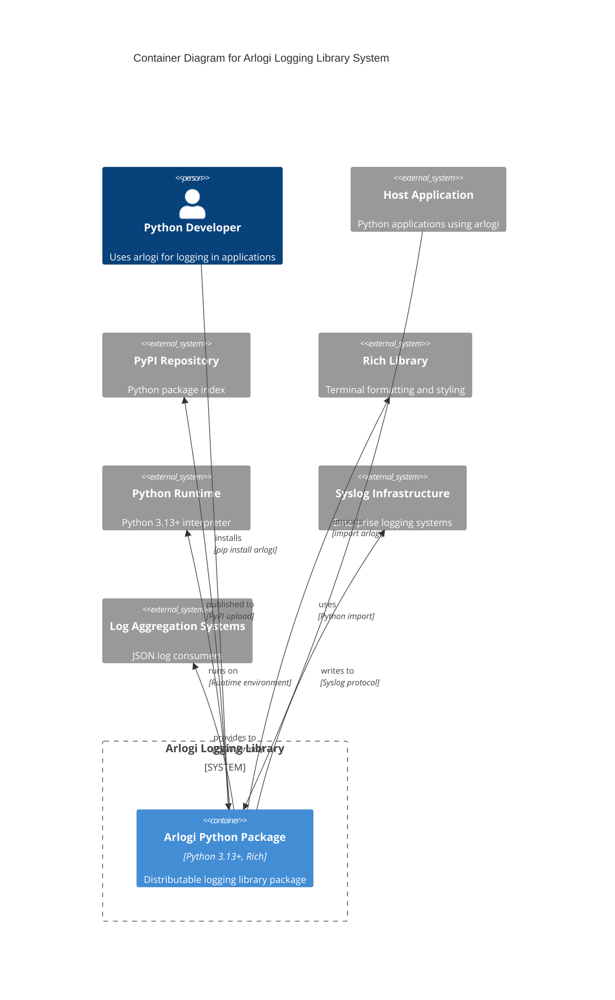

# C4 Container Level: `arlogi` Logging Library Deployment

## Containers

### `arlogi` Python Package

- **Name**: `arlogi` Enhanced Logging Library Package
- **Description**: Distributable Python package providing comprehensive logging functionality with enhanced features for modern applications
- **Type**: Library Package
- **Technology**: Python 3.13+, Rich Terminal Library, Hatchling Build Backend
- **Deployment**: PyPI Package Distribution, Python Wheel Distribution

## Purpose

The `arlogi` Python Package container represents the distributable unit of the `arlogi` Enhanced Logging Library. This container is designed as a Python package that can be installed via pip from PyPI or directly from source. It encapsulates all the logging functionality into a single, installable unit that applications can depend on for their logging needs.

The container serves as a deployment unit that:

- **Packages all components**: Bundles the core logger, factory, handlers, and formatters into a distributable format
- **Provides clean API**: Exposes a well-defined public API through the package's **init**.py
- **Manages dependencies**: Declares and manages runtime dependencies (Rich library)
- **Ensures compatibility**: Maintains compatibility with Python's standard logging framework
- **Supports multiple environments**: Works in development, testing, and production environments

## Components

This container packages the following components:

- **TraceLogger**: Enhanced logger implementation with custom TRACE level and caller attribution
  - Documentation: [c4-component-arlogi-logging-library.md](./c4-component-arlogi-logging-library.md)
  - Core Features: Custom TRACE logging, caller attribution, enhanced debugging
- **LoggerFactory**: Factory class for logger creation and configuration management
  - Documentation: [c4-component-arlogi-logging-library.md](./c4-component-arlogi-logging-library.md)
  - Core Features: Logger instantiation, global configuration, singleton pattern
- **ColoredConsoleHandler**: Rich-based console output handler with styling
  - Documentation: [c4-component-arlogi-logging-library.md](./c4-component-arlogi-logging-library.md)
  - Core Features: Colored output, Rich formatting, level-based styling
- **JSONHandler**: Structured JSON logging output handler
  - Documentation: [c4-component-arlogi-logging-library.md](./c4-component-arlogi-logging-library.md)
  - Core Features: JSON serialization, metadata enrichment, machine-readable logs
- **ArlogiSyslogHandler**: Enterprise syslog integration handler
  - Documentation: [c4-component-arlogi-logging-library.md](./c4-component-arlogi-logging-library.md)
  - Core Features: Syslog protocol, platform-specific fallbacks, enterprise integration
- **JSONFormatter**: JSON record formatting with metadata
  - Documentation: [c4-component-arlogi-logging-library.md](./c4-component-arlogi-logging-library.md)
  - Core Features: Structured formatting, timestamp handling, field enrichment
- **LoggerProtocol**: Type-safe interface definition
  - Documentation: [c4-component-arlogi-logging-library.md](./c4-component-arlogi-logging-library.md)
  - Core Features: Protocol-based design, type safety, interface compliance
- **TRACE Level**: Custom logging level registration
  - Documentation: [c4-component-arlogi-logging-library.md](./c4-component-arlogi-logging-library.md)
  - Core Features: Level 5 logging, fine-grained debugging, standard compatibility

## Interfaces

### Package Public API

- **Protocol**: Python Module Interface
- **Description**: Main package API exposed through the arlogi module
- **Specification**: [arlogi-api.yaml](./apis/arlogi-api.yaml)
- **Exposed Functions**:
  - `get_logger(name: str, level: int | str | None) -> LoggerProtocol` - Get configured logger instance
  - `get_json_logger(name: str, json_file_name: str | None) -> LoggerProtocol` - Get JSON-formatted logger
  - `get_syslog_logger(name: str, address: str | tuple[str, int]) -> LoggerProtocol` - Get syslog logger
  - `setup_logging(level, module_levels, json_file_name, json_file_only, use_syslog, syslog_address, show_time, show_level, show_path) -> None` - Configure global logging settings
  - `LoggerFactory` - Factory class for advanced logger management
  - `LoggerProtocol` - Type-safe logger interface
  - `TRACE` - Custom TRACE level constant

### LoggerProtocol Interface

- **Protocol**: Python Protocol Interface
- **Description**: Standardized interface that all logger implementations must follow
- **Specification**: [arlogi-api.yaml](./apis/arlogi-api.yaml)
- **Operations**:
  - `trace(msg: Any, *args: Any, from_caller: int | None = None, from_: int | None = None, **kwargs: Any) -> None`
  - `debug(msg: Any, *args: Any, from_caller: int | None = None, from_: int | None = None, **kwargs: Any) -> None`
  - `info(msg: Any, *args: Any, from_caller: int | None = None, from_: int | None = None, **kwargs: Any) -> None`
  - `warning(msg: Any, *args: Any, from_caller: int | None = None, from_: int | None = None, **kwargs: Any) -> None`
  - `error(msg: Any, *args: Any, from_caller: int | None = None, from_: int | None = None, **kwargs: Any) -> None`
  - `critical(msg: Any, *args: Any, from_caller: int | None = None, from_: int | None = None, **kwargs: Any) -> None`
  - `fatal(msg: Any, *args: Any, from_caller: int | None = None, from_: int | None = None, **kwargs: Any) -> None`
  - `exception(msg: Any, *args: Any, from_caller: int | None = None, from_: int | None = None, **kwargs: Any) -> None`
  - `log(level: int, msg: Any, *args: Any, from_caller: int | None = None, from_: int | None = None, **kwargs: Any) -> None`
  - `setLevel(level: int | str) -> None`
  - `isEnabledFor(level: int) -> bool`
  - `getEffectiveLevel() -> int`
  - `name: str` (property)

### LoggerFactory Configuration API

- **Protocol**: Factory Configuration Interface
- **Description**: Factory methods for creating and configuring logger instances
- **Specification**: [arlogi-api.yaml](./apis/arlogi-api.yaml)
- **Operations**:
  - `setup(level: int | str, module_levels: dict[str, str | int] | None, json_file_name: str | None, json_file_only: bool, use_syslog: bool, syslog_address: str | tuple[str, int], show_time: bool, show_level: bool, show_path: bool) -> None`
  - `get_logger(name: str, level: int | str | None) -> LoggerProtocol`
  - `get_json_logger(name: str, json_file_name: str | None) -> LoggerProtocol`
  - `get_syslog_logger(name: str, address: str | tuple[str, int]) -> LoggerProtocol`
  - `get_global_logger() -> LoggerProtocol`
  - `is_test_mode() -> bool`

## Dependencies

### Runtime Dependencies

- **Rich>=14.2.0**: Terminal formatting library used for colored console output and rich tracebacks
  - **Communication Protocol**: Python import, direct library usage
  - **Purpose**: Provides colored console output, styled text, rich tracebacks, enhanced visual presentation

### Python Runtime Environment

- **Python 3.13+**: Runtime environment with Protocol support and enhanced typing features
  - **Communication Protocol**: Runtime execution environment
  - **Purpose**: Provides core Python functionality, Protocol support, typing enhancements

### Python Standard Library Integration

- **logging**: Core Python logging framework
  - **Communication Protocol**: Inheritance and composition
  - **Purpose**: Base logging functionality, standard logging patterns
- **logging.handlers**: Syslog handler implementations
  - **Communication Protocol**: Import and extension
  - **Purpose**: Enterprise syslog integration
- **datetime**: Timestamp formatting and metadata
  - **Communication Protocol**: Direct usage
  - **Purpose**: Log timestamp generation and formatting
- **json**: JSON serialization for structured logging
  - **Communication Protocol**: Direct usage
  - **Purpose**: JSON log format generation
- **sys**: System utilities and stack inspection
  - **Communication Protocol**: Direct usage
  - **Purpose**: Caller attribution, stack frame inspection
- **os**: Environment variable detection
  - **Communication Protocol**: Direct usage
  - **Purpose**: Test mode detection, environment awareness

### External Systems Integration

- **Syslog Infrastructure**: Enterprise logging systems (Rsyslog, Syslog-ng, cloud logging services)
  - **Communication Protocol**: Syslog protocol (UDP/TCP, Unix sockets)
  - **Purpose**: Enterprise log aggregation, centralized logging
- **Log Aggregation Systems**: JSON log consumers (ELK Stack, Splunk, Datadog, etc.)
  - **Communication Protocol**: File streams, HTTP APIs, log forwarders
  - **Purpose**: Log analysis, monitoring, alerting

## Infrastructure

- **Deployment Config**: [pyproject.toml](../pyproject.toml)
- **Build System**: Hatchling build backend for Python packaging
- **Distribution**: PyPI package repository for public distribution
- **Package Format**: Wheel distribution (.whl) for optimal installation performance
- **Source Distribution**: Source distribution (.tar.gz) for complete source access

### Scaling Considerations

- **Library Scaling**: Designed for use in applications of any size
- **Performance**: Optimized logging path with minimal overhead
- **Memory**: Efficient memory usage with configurable handler selection
- **Concurrency**: Thread-safe logging operations

### Resource Requirements

- **CPU**: Minimal overhead for standard logging operations
- **Memory**: Small memory footprint for library components
- **Storage**: No persistent storage requirements (writes to stdout/stderr or syslog)
- **Network**: Optional network connectivity for syslog integration

## Container Diagram

## API Documentation Links

- **Package API Specification**: [arlogi-api.yaml](./apis/arlogi-api.yaml)
- **Component Documentation**: [c4-component-arlogi-logging-library.md](./c4-component-arlogi-logging-library.md)
- **System Component Overview**: [c4-component.md](./c4-component.md)

## Deployment Notes

### Installation Methods

1. **PyPI Installation**: `pip install arlogi`
2. **Development Installation**: `pip install -e .`
3. **Source Installation**: `python -m pip install .`

### Version Management

- **Semantic Versioning**: Follows semantic versioning (MAJOR.MINOR.PATCH)
- **Python Compatibility**: Requires Python 3.13 or higher
- **Dependency Management**: Minimal external dependencies for easy adoption

### Configuration

- **Global Configuration**: Single setup method for system-wide logging configuration
- **Module-Specific Configuration**: Granular control per module or submodule
- **Environment Awareness**: Automatic test mode detection for development workflows
