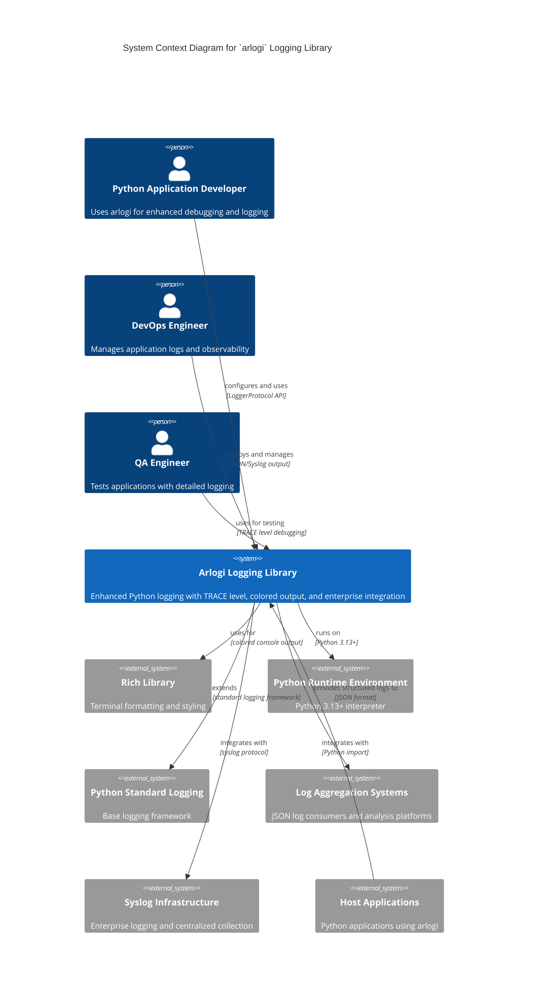

# C4 Context Level: System Context

## System Overview

### Short Description

`arlogi` is an enhanced Python logging library that provides advanced debugging capabilities, structured output formats, and enterprise-grade logging infrastructure integration.

### Long Description

`arlogi` is a comprehensive logging solution for Python applications that extends the standard logging module with modern features designed for both development and production environments. The library addresses common logging challenges by providing custom TRACE level logging for ultra-detailed debugging, rich terminal formatting with color-coded output, structured JSON logging for log aggregation systems, enterprise syslog integration, and unique caller attribution features that help developers trace code execution paths. `arlogi` solves the problem of inadequate debugging visibility in complex applications by offering fine-grained logging levels while maintaining compatibility with Python's standard logging framework, making it easy to integrate into existing codebases without breaking changes.

## Personas

### Python Application Developer

- **Type**: Human User
- **Description**: Software developers building Python applications who need comprehensive logging capabilities for debugging, monitoring, and maintaining their code. They work on applications ranging from small utilities to large-scale enterprise systems.
- **Goals**:
  - Debug complex application flows with detailed logging
  - Monitor application behavior in development and production
  - Integrate structured logging with modern observability platforms
  - Maintain clean, readable console output during development
  - Implement enterprise-grade logging for production deployments
- **Key Features Used**: All features including TRACE level, colored console output, JSON logging, syslog integration, caller attribution, module-specific levels

### DevOps Engineer

- **Type**: Human User
- **Description**: Operations professionals responsible for deploying, monitoring, and maintaining Python applications in production environments. They focus on observability, log aggregation, and system reliability.
- **Goals**:
  - Aggregate and analyze application logs from multiple services
  - Monitor system health and detect issues quickly
  - Integrate application logs with enterprise logging infrastructure
  - Implement structured logging for automated log processing
  - Ensure consistent logging formats across microservices
- **Key Features Used**: JSON logging, syslog integration, structured output, enterprise logging standards

### Quality Assurance Engineer

- **Type**: Human User
- **Description**: Testing professionals who need detailed logging information to verify application behavior, troubleshoot test failures, and validate system functionality during testing phases.
- **Goals**:
  - Capture detailed execution traces for test analysis
  - Verify application behavior through log inspection
  - Debug test failures with detailed context
  - Validate error handling and edge cases
  - Generate comprehensive test reports with logging data
- **Key Features Used**: TRACE level logging, caller attribution, module-specific debugging levels, structured output

### Log Aggregation Systems

- **Type**: External System
- **Description**: Enterprise logging platforms and log management systems that consume, process, and analyze application logs for monitoring, alerting, and compliance purposes.
- **Goals**:
  - Ingest structured log data from applications
  - Parse and index log records for searching and analysis
  - Generate alerts based on log patterns and thresholds
  - Provide dashboards and visualizations for log data
  - Maintain log retention and compliance requirements
- **Key Features Used**: JSON logging, structured output, metadata enrichment, standardized formats

### Syslog Infrastructure

- **Type**: External System
- **Description**: Enterprise syslog servers and logging infrastructure that collect logs from multiple applications and systems for centralized management and analysis.
- **Goals**:
  - Receive syslog messages from applications
  - Route logs to appropriate storage and analysis systems
  - Maintain log integrity and delivery guarantees
  - Support enterprise logging standards and protocols
  - Provide reliable log collection in distributed environments
- **Key Features Used**: Syslog protocol integration, enterprise logging standards, centralized log collection

## System Features

### Enhanced Logging Levels

- **Description**: Custom TRACE level (level 5) for ultra-detailed debugging that fills the gap between DEBUG and INFO levels, providing developers with fine-grained control over logging verbosity.
- **Users**: Python Application Developer, Quality Assurance Engineer
- **User Journey**: [Enhanced Logging Levels - Python Application Developer Journey](#enhanced-logging-levels---python-application-developer-journey)

### Premium Colored Console Output

- **Description**: Rich terminal formatting with color-coded log levels, automatic traceback support, and customizable visual elements that make console logs more readable and easier to parse during development.
- **Users**: Python Application Developer, Quality Assurance Engineer
- **User Journey**: [Premium Colored Console Output - Python Application Developer Journey](#premium-colored-console-output---python-application-developer-journey)

### Structured JSON Logging

- **Description**: Machine-readable JSON log format with metadata enrichment, perfect for log aggregation systems, automated log processing, and modern observability platforms.
- **Users**: Python Application Developer, DevOps Engineer, Log Aggregation Systems
- **User Journey**: [Structured JSON Logging - DevOps Engineer Journey](#structured-json-logging---devops-engineer-journey)

### Module-Specific Configuration

- **Description**: Granular control over logging levels for different modules and components, allowing developers to enable detailed logging for specific parts of the application while keeping other areas less verbose.
- **Users**: Python Application Developer, Quality Assurance Engineer
- **User Journey**: [Module-Specific Configuration - Python Application Developer Journey](#module-specific-configuration---python-application-developer-journey)

### Dedicated Destination Loggers

- **Description**: Specialized loggers that output only to specific destinations (JSON or syslog) without cluttering the console, ideal for audit trails, security logs, and enterprise compliance requirements.
- **Users**: Python Application Developer, DevOps Engineer
- **User Journey**: [Dedicated Destination Loggers - DevOps Engineer Journey](#dedicated-destination-loggers---devops-engineer-journey)

### Enterprise Syslog Integration

- **Description**: Native syslog protocol support with platform-specific fallbacks for enterprise logging infrastructure, ensuring compatibility with existing log management systems.
- **Users**: Python Application Developer, DevOps Engineer, Syslog Infrastructure
- **User Journey**: [Enterprise Syslog Integration - Syslog Infrastructure Journey](#enterprise-syslog-integration---syslog-infrastructure-journey)

### Advanced Caller Attribution

- **Description**: Unique feature that shows the calling function and module for log messages, making it easy to trace code execution paths and debug complex application flows.
- **Users**: Python Application Developer, Quality Assurance Engineer
- **User Journey**: [Advanced Caller Attribution - Python Application Developer Journey](#advanced-caller-attribution---python-application-developer-journey)

## User Journeys

### Enhanced Logging Levels - Python Application Developer Journey

1. **Installation Phase**: Developer installs `arlogi` via `pip install arlogi` in their Python project
2. **Basic Setup**: Developer imports `arlogi` and calls `setup_logging(level=logging.INFO)` to configure global logging
3. **Development Phase**: Developer uses standard logging levels (INFO, DEBUG, etc.) for general application logging
4. **Detailed Debugging**: When encountering complex issues, developer enables TRACE level with `setup_logging(level=TRACE)` for ultra-detailed execution traces
5. **Module-Specific Debugging**: Developer sets module-specific levels using `module_levels={"my_app.db": "DEBUG", "my_app.network": TRACE}` to focus on specific components
6. **Production Deployment**: Developer sets appropriate levels for production environment while maintaining detailed logging for critical modules

### Premium Colored Console Output - Python Application Developer Journey

1. **Development Setup**: Developer uses `setup_logging()` with default settings which enables colored console output
2. **Console Monitoring**: Developer observes color-coded log messages in terminal during application execution (grey for TRACE/DEBUG, white for INFO, yellow for WARNING, red for ERROR/CRITICAL)
3. **Rich Tracebacks**: When exceptions occur, developer sees enhanced traceback information with better formatting and context
4. **Customization**: Developer can adjust console appearance using parameters like `show_time=True`, `show_level=True`, `show_path=False`
5. **Development Workflow**: Developer benefits from improved readability and quick visual identification of log message severity during active development

### Structured JSON Logging - DevOps Engineer Journey

1. **Infrastructure Setup**: DevOps engineer configures log aggregation system (ELK Stack, Splunk, etc.) to receive JSON log data
2. **Application Configuration**: Developer enables JSON logging with `setup_logging(json_file_only=True)` for console JSON output or `setup_logging(json_file_name="app.log")` for file-based JSON logging in application configuration
3. **Log Collection**: Log aggregation system receives structured JSON logs with consistent fields for message, level, timestamp, and metadata
4. **Analysis and Monitoring**: DevOps engineer creates dashboards, alerts, and automated analysis using structured log data
5. **Operational Benefits**: Team benefits from automated log parsing, searching, filtering, and alerting capabilities

### Module-Specific Configuration - Python Application Developer Journey

1. **Initial Setup**: Developer sets global logging level to INFO for normal application operation
2. **Problem Identification**: Developer identifies issues in specific modules (database operations, network communications, etc.)
3. **Targeted Debugging**: Developer configures module-specific levels: `setup_logging(module_levels={"app.db": "DEBUG", "app.network": TRACE})`
4. **Isolated Investigation**: Developer receives detailed logs only from problematic modules while keeping overall log volume manageable
5. **Iterative Debugging**: Developer adjusts module-specific levels as needed during debugging process
6. **Production Configuration**: Developer maintains different module-level configurations for production vs development environments

### Dedicated Destination Loggers - DevOps Engineer Journey

1. **Compliance Requirements**: DevOps engineer identifies need for audit logging that doesn't interfere with console output
2. **JSON Audit Logger**: Developer uses `get_json_logger("audit", "audit.log")` to create logger that outputs JSON to file for audit trails
3. **Security Logging**: Developer implements `get_json_logger("security")` for security-related events with structured JSON data
4. **Log Routing**: JSON audit logs are automatically routed to log aggregation systems without cluttering console output
5. **Operational Efficiency**: Operations team benefits from clean console output while maintaining comprehensive audit trails

### Enterprise Syslog Integration - Syslog Infrastructure Journey

1. **Infrastructure Preparation**: Syslog infrastructure is configured to receive logs from Python applications
2. **Application Integration**: Developer enables syslog output with `setup_logging(use_syslog=True, syslog_address="/dev/log")`
3. **Message Reception**: Syslog infrastructure receives structured log messages from `arlogi` applications
4. **Enterprise Processing**: Syslog servers process and route messages according to enterprise logging policies
5. **Centralized Management**: Operations team manages all application logs through centralized syslog infrastructure

### Advanced Caller Attribution - Python Application Developer Journey

1. **Code Investigation**: Developer needs to understand complex code execution paths and function call chains
2. **Basic Attribution**: Developer uses `logger.info("message", from_=0)` to show immediate calling function: `[function_name()]`
3. **Deep Attribution**: Developer uses `logger.info("message", from_=2)` to show caller's caller: `[from module.function_name()]`
4. **Cross-Module Debugging**: Developer traces function calls across different modules to understand data flow
5. **Production Debugging**: In production, developer can add caller attribution to specific log messages to troubleshoot issues
6. **Debugging Efficiency**: Developer saves significant time by understanding exactly where log messages originate in complex call stacks

## External Systems and Dependencies

### Rich Library

- **Type**: Python Library Dependency
- **Description**: Terminal formatting and styling library that provides rich console output, colored text, and enhanced traceback formatting for improved developer experience.
- **Integration Type**: Python import and direct library usage
- **Purpose**: Provides the foundation for colored console output, rich text formatting, and enhanced visual presentation of log messages in terminal environments.

### Python Runtime Environment

- **Type**: Runtime Dependency
- **Description**: Python 3.13+ interpreter that provides the core execution environment, Protocol support, and enhanced typing features required by `arlogi`.
- **Integration Type**: Runtime execution environment
- **Purpose**: Provides fundamental Python functionality, type system support, and runtime capabilities for the logging library.

### Python Standard Logging Framework

- **Type**: Framework Dependency
- **Description**: Core Python logging module that provides the foundation for logging functionality, standard interfaces, and base logging patterns.
- **Integration Type**: Inheritance, composition, and extension
- **Purpose**: Provides base logging functionality, standard logging patterns, and compatibility with existing Python logging ecosystem.

### Log Aggregation Systems

- **Type**: External System
- **Description**: Enterprise log management platforms (ELK Stack, Splunk, Datadog, etc.) that consume, process, and analyze structured JSON log data for monitoring and observability.
- **Integration Type**: JSON format output, file streams, HTTP APIs, log forwarders
- **Purpose**: Enables automated log processing, analysis, alerting, and dashboarding for operational monitoring and business intelligence.

### Syslog Infrastructure

- **Type**: External System
- **Description**: Enterprise logging systems (Rsyslog, Syslog-ng, cloud logging services) that provide centralized log collection, routing, and management following industry-standard syslog protocol.
- **Integration Type**: Syslog protocol (UDP/TCP, Unix sockets), enterprise logging standards
- **Purpose**: Provides enterprise-grade log collection, centralized management, compliance support, and integration with existing logging infrastructure.

## System Context Diagram

## Related Documentation

- [Container Documentation](./c4-container.md)
- [Component Documentation](./c4-component.md)
