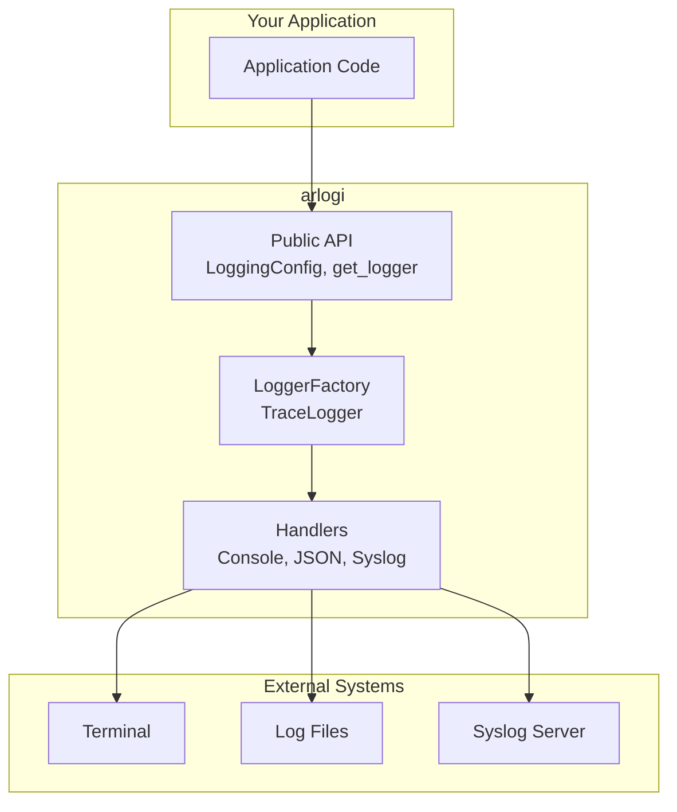
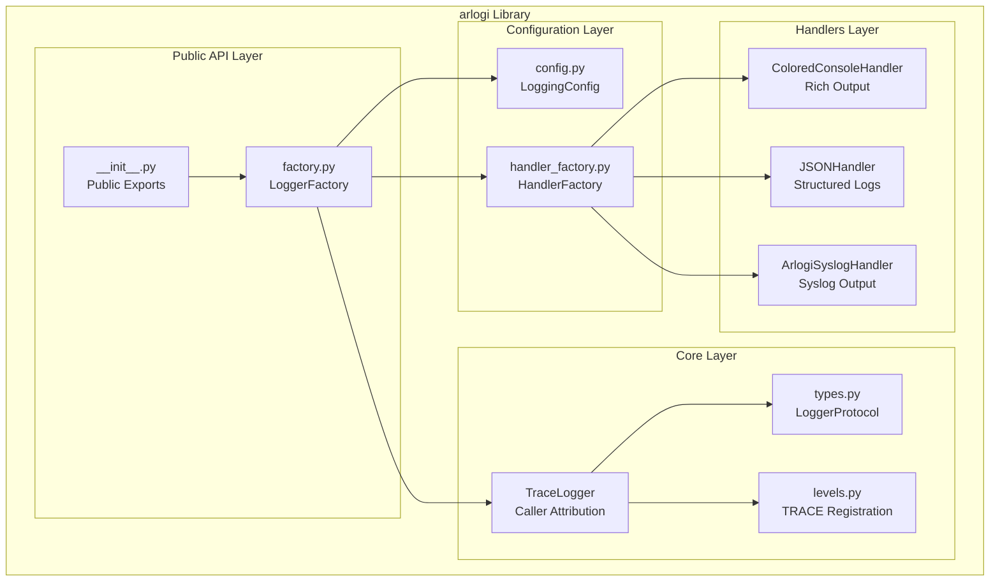
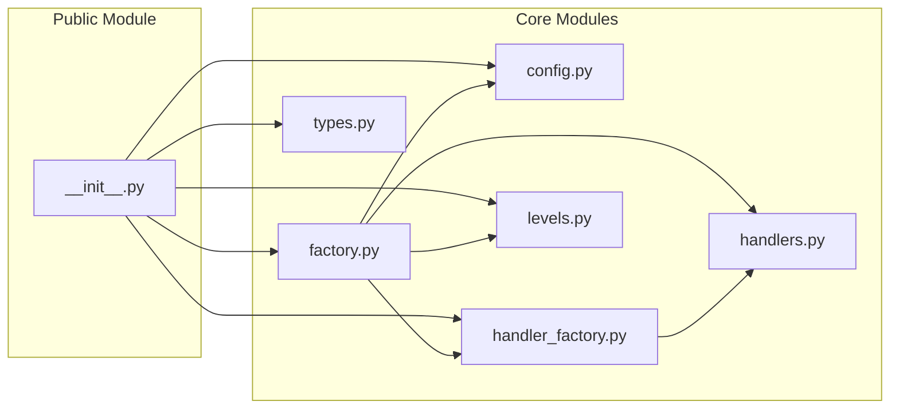
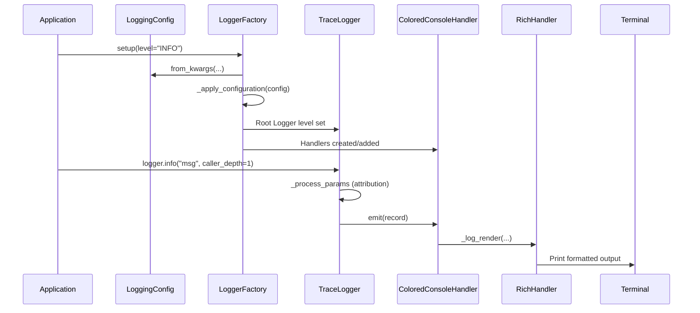
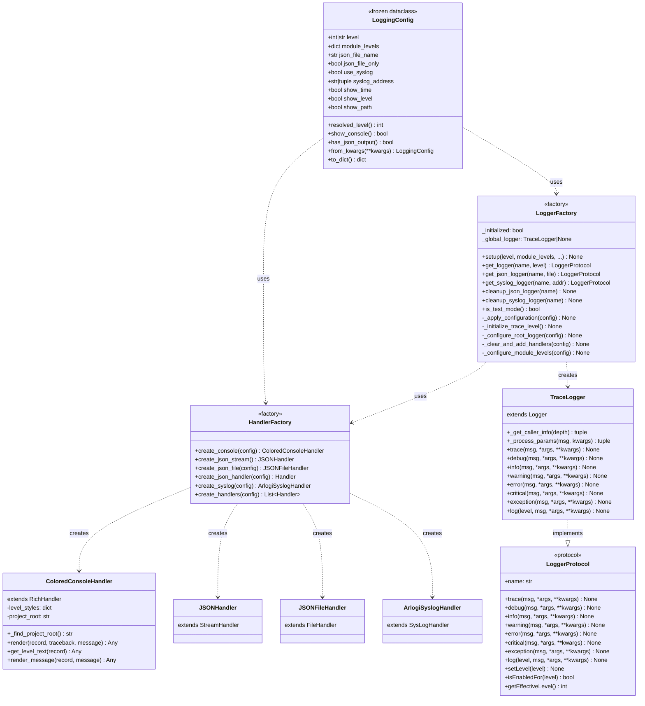
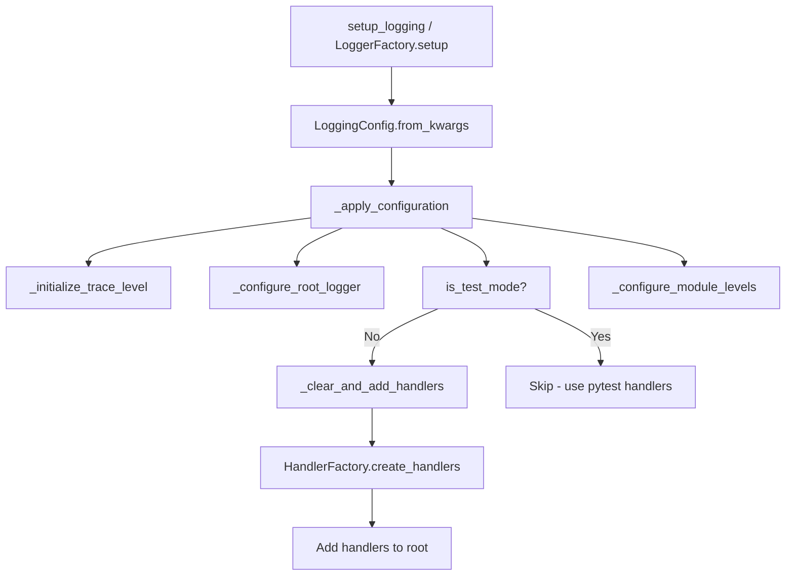
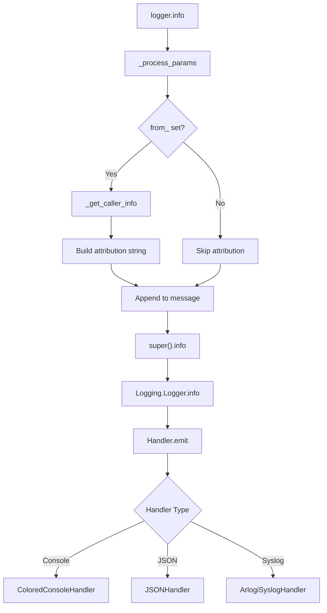
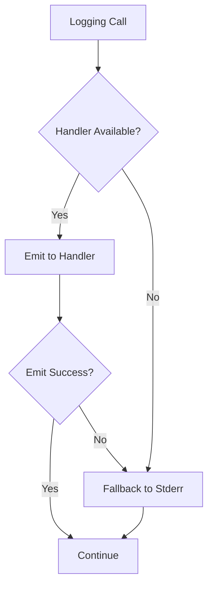

# Arlogi Architecture and Project Conventions

---

## FILE: README.md

<p align="center">
  
</p>

# `arlogi` - Advanced Logging Library

`arlogi` is a robust, type-safe logging library for Python that extends the standard logging module with modern features, caller attribution, file rotation, and premium aesthetics.

**[Full Documentation](https://antragh.github.io/arlogi/)**

## Features

- **Caller Attribution**: Track log calls across function boundaries using `caller_depth`.
- **Custom TRACE Level**: Level 5 logging for ultra-detailed debugging.
- **Premium Colored Output**: Uses `rich` for beautiful, readable console logs with automatic traceback support.
- **Structured JSON Logging**: Out-of-the-box support for JSON logging, file rotation, and log retention.
- **Module-Specific Configuration**: Easily set different log levels for different parts of your application.
- **Dedicated Destination Loggers**: Log specific events only to JSON or Syslog without cluttering the console.
- **Type Safety**: Fully type-checked with `LoggerProtocol` and supports modern Python types.

## Installation

```bash
# Using uv (recommended)
uv add arlogi

# Or using pip
pip install arlogi
```

## Usage

### Basic Setup

```python
from arlogi import setup_logging, get_logger

# 1. Initialize logging
setup_logging(level="INFO")

# 2. Get a logger
logger = get_logger("my_app")
logger.info("Application started", caller_depth=0)
logger.trace("This won't be visible because level is INFO")
```

### Module-Specific Levels

```python
from arlogi import setup_logging, TRACE

setup_logging(
    level="INFO",
    module_levels={
        "my_app.db": "DEBUG",
        "my_app.network": TRACE
    }
)
```

### JSON File Rotation and Syslog

```python
from arlogi import setup_logging

setup_logging(
    level="INFO",
    json_file_name="logs/app.jsonl",
    rotate_schedule="day",
    rotate_retention_count=7,
    use_syslog=True,
    syslog_address="/dev/log"
)
```

### Dedicated Loggers

Sometimes you want to log specific data ONLY to a file or a remote system:

```python
from arlogi import get_json_logger, get_syslog_logger, cleanup_json_logger

# Logs only to JSON, not to console
audit_logger = get_json_logger("audit", "logs/audit.jsonl")
audit_logger.info("User logged in", user_id=123)

# Logs only to Syslog
syslog_logger = get_syslog_logger("security")
syslog_logger.warning("Failed login attempt")

# Resource cleanup when done
cleanup_json_logger("audit")
```

## Integration with Other Libraries

`arlogi` works seamlessly with any third‑party library that uses the standard `logging` module.

### Default INFO when `arlogi` is Not Imported

If your application never imports `arlogi`, the standard `logging` defaults (WARNING) remain unchanged. To get a simple INFO level without pulling in `arlogi`, add a tiny bootstrap:

```python
import logging
logging.basicConfig(level=logging.INFO)
```

### Overriding the Level when You _do_ Use `arlogi`

Initialize `arlogi` with `setup_logging()` early in your program. `setup_logging()` allows fine-grained control over levels and handlers.

### Making third‑party Libraries Respect the Chosen Level

All libraries that obtain a logger via `logging.getLogger(name)` inherit the level from the nearest ancestor – usually the root logger configured via `setup_logging()`. If a library forces its own level, reset it:

```python
import logging
logging.getLogger("some_lib").setLevel(logging.NOTSET)  # inherit from root
```

### Quick Bootstrap Example

```python
# bootstrap.py
import os, logging
from arlogi import setup_logging

def configure_logging():
    if os.getenv("USE_ARLOGI", "0") == "1":
        level = os.getenv("ARLOGI_LEVEL", "INFO").upper()
        setup_logging(level=level)
    else:
        logging.basicConfig(level=logging.INFO)

# main.py
from bootstrap import configure_logging
configure_logging()
```

With this pattern you get:

- **Default INFO** when `arlogi` is absent.
- **Full control** over the log level when you import `arlogi`.
- **Automatic inheritance** for any library that uses `logging`.

### Using TRACE in Your Library

If you are developing a library and want to use the **TRACE** level:

1. **The Safe Way (Recommended)**: Use `logger.log(TRACE, ...)`
   This works regardless of when your library is imported relative to `arlogi` setup.

   ```python
   import logging
   try:
       from arlogi import TRACE
   except ImportError:
       TRACE = 5

   logger = logging.getLogger(__name__)

   def complex_operation():
       logger.log(TRACE, "Step 1 of complex operation...")
   ```

2. **The method way**: `logger.trace(...)`
   This **only** works if `arlogi` is configured before your library creates its logger instance.

### Lazy Initialization (Safe Use of .trace)

If you _must_ use `.trace()` in your library but aren't sure if `arlogi` is setup yet, you can use lazy initialization with `LoggerProtocol` for type safety:

```python
from arlogi import LoggerProtocol, get_logger

_logger: LoggerProtocol | None = None

def log() -> LoggerProtocol:
    """Get or create the logger for this module lazily."""
    global _logger
    if _logger is None:
        _logger = get_logger("my_lib.cache")
    return _logger
```

## Advanced Configuration

### Centralized Logging Setup

For full control over console output, file paths, and remote handlers:

```python
from arlogi import setup_logging

setup_logging(
    level="INFO",
    module_levels={"app.db": "DEBUG"},
    json_file_name="logs/app.jsonl",
    show_time=True,
    show_level=True,
    show_path=False
)
```

### Direct Factory API

Alternatively, `LoggerFactory.setup(...)` provides the exact same functionality via the factory class:

```python
from arlogi import LoggerFactory

LoggerFactory.setup(
    level="INFO",
    module_levels={"app.db": "DEBUG"}
)
```

### Color Schemes

`arlogi` comes with a refined default color scheme:

- **TRACE / DEBUG**: Grey / Cyan
- **INFO**: Green
- **WARNING**: Yellow
- **ERROR / CRITICAL**: Red

## Development

Run tests with pytest:

```bash
uv run pytest
```

Check code formatting and linting:

```bash
uv run ruff check .
```

Build local documentation:

```bash
uv run mkdocs build
```

## License

MIT License - see [LICENSE](LICENSE) file for details.

---

## FILE: CLAUDE.md

## Graphify

This project has a graphify knowledge graph at graphify-out/.

Rules:

- Before answering architecture or codebase questions, read graphify-out/GRAPH_REPORT.md for god nodes and community structure
- If graphify-out/wiki/index.md exists, navigate it instead of reading raw files
- After modifying code files in this session, run `uv run python3 -c "from graphify.watch import _rebuild_code; from pathlib import Path; _rebuild_code(Path('.'))"` to keep the graph current
- Always treat AST-based structure in graph.json as the source of truth if it conflicts with documentation in docs/

---

## FILE: pyproject.toml

```toml
[project]
name = "arlogi"
version = "0.606.22"
description = "Robust, type-safe and highly configurable logging library for Python"
readme = "README.md"
authors = [
    { name = "Anton Razumov", email = "arazumov@checkpoint.com" }
]
requires-python = ">=3.13"
dependencies = [
    "graphifyy",
    "rich>=14.2.0",
]

[build-system]
requires = ["hatchling"]
build-backend = "hatchling.build"

[dependency-groups]
dev = [
    "pytest>=9.0.2",
    "pytest-cov>=7.0.0",
    "radon>=6.0.1",
    "ruff>=0.14.10",
    "mkdocs-git-revision-date-localized-plugin>=1.5.0",
    "mkdocs-minify-plugin>=0.8.0",
    "mkdocs-material>=9.7.1",
    "mkdocstrings>=1.0.0",
    "mkdocstrings-python>=1.16.2",
    "pymdown-extensions>=10.19.1",
    "psutil>=7.2.1",
]

[tool.uv.sources]
graphifyy = { git = "https://github.com/Graphify-Labs/graphify" }

[tool.pytest.ini_options]
testpaths = ["tests"]
pythonpath = ["src"]


```

---

## FILE: docs/index.md

# Arlogi Library Documentation

**Version:** 0.606.22

**Python:** 3.13+

**License:** MIT

Comprehensive documentation for the arlogi logging library - a robust, type-safe, and highly configurable logging solution for Python applications.

---

## Key Features

- **🎯 Caller Attribution**: Trace log calls across function boundaries using `caller_depth` parameter
- **📊 Custom TRACE Level**: Ultra-detailed logging below DEBUG (level 5)
- **🎨 Rich Console Output**: Beautiful colored terminal output with Rich library
- **📝 JSON Logging**: Structured JSON logs for machine parsing and analysis
- **🔧 Type-Safe Configuration**: Modern `LoggingConfig` dataclass for compile-time safety
- **🧪 Test-Aware**: Automatic test mode detection for seamless pytest integration
- **🔌 Multiple Handlers**: Console, JSON file, and Syslog support
- **🏗️ Modular Handlers**: Dedicated JSON-only and syslog-only loggers

---

## Quick Start

```python
from arlogi import setup_logging, get_logger

# Configure logging using modern architecture
setup_logging(level="INFO")

# Get logger and log
logger = get_logger(__name__)
logger.info("Hello, Arlogi!", caller_depth=0)
```

**Output:**

```text
INFO    Hello, Arlogi!        [module()]
```

---

## Documentation Guide

### Getting Started

- **Installation and basic usage**: Get started with arlogi quickly
- **Caller Attribution Feature**: Learn about the unique `caller_depth` parameter

## Documentation

### 📖 User Documentation

1. **[User Guide](USER_GUIDE.md)**

   - Installation and setup
   - Basic usage patterns
   - Configuration options
   - Caller attribution guide
   - Common patterns
   - Troubleshooting tips

2. **[Configuration Guide](CONFIGURATION_GUIDE.md)**

   - Modern `LoggingConfig` architecture
   - Global configuration patterns
   - Per-module level overrides
   - Handler configuration
   - Environment-specific setups
   - Dynamic configuration

3. **[Caller Attribution Examples](CALLER_ATTRIBUTION_EXAMPLES.md)**

   - Basic depth usage (`caller_depth=0`, `caller_depth=1`)
   - Cross-module attribution
   - Real-world patterns (web APIs, databases, background jobs)
   - Performance considerations
   - Testing examples

### 🔧 Developer Documentation

4. **[Developer Guide](DEVELOPER_GUIDE.md)**

   - Development setup
   - Project structure
   - Testing strategies
   - Code quality standards
   - Release process
   - Contributing guidelines

5. **[Architecture Documentation](ARCHITECTURE.md)**

   - System design overview
   - Architecture diagrams (C4 model)
   - Design patterns
   - Component reference
   - Data flow
   - Extensibility points

### 📚 API Reference

6. **[API Reference](API_REFERENCE.md)**

   - Public API functions
   - `LoggingConfig` reference
   - `LoggerProtocol` interface
   - Handler classes
   - Log levels
   - Type hints
   - Examples

---

## Key Features by Category

### 🎯 Caller Attribution

| Feature | Description | Documentation |
|---------|-------------|---------------|
| `caller_depth=0` | Shows current function | [Examples](CALLER_ATTRIBUTION_EXAMPLES.md#using-caller_depth0-current-function) |
| `caller_depth=1` | Shows immediate caller | [Examples](CALLER_ATTRIBUTION_EXAMPLES.md#using-caller_depth1-immediate-caller) |
| `caller_depth=2+` | Shows deeper context | [Examples](CALLER_ATTRIBUTION_EXAMPLES.md#using-caller_depth2-callers-caller) |
| Cross-module | Tracks across modules | [Examples](CALLER_ATTRIBUTION_EXAMPLES.md#cross-module-attribution) |

### 🔧 Configuration

| Feature | Description | Documentation |
|---------|-------------|---------------|
| `LoggingConfig` | Type-safe configuration | [Config Guide](CONFIGURATION_GUIDE.md#basic-setup) |
| Module Levels | Per-module overrides | [Config Guide](CONFIGURATION_GUIDE.md#per-module-configuration) |
| JSON Logging | Structured output | [Config Guide](CONFIGURATION_GUIDE.md#json-file-configuration) |
| Syslog | System log integration | [Config Guide](CONFIGURATION_GUIDE.md#syslog-configuration-modern) |

### 📊 Log Levels

| Level | Value | Use Case |
|-------|-------|----------|
| `TRACE` | 5 | Function entry/exit, variable dumps |
| `DEBUG` | 10 | Detailed troubleshooting |
| `INFO` | 20 | General application flow |
| `WARNING` | 30 | Unexpected but recoverable |
| `ERROR` | 40 | Errors that don't stop execution |
| `CRITICAL` | 50 | Serious failures |

### 🎨 Handlers

| Handler | Purpose | Documentation |
|---------|---------|---------------|
| `ColoredConsoleHandler` | Rich console output | [API Reference](API_REFERENCE.md#coloredconsolehandler) |
| `JSONHandler` | JSON to stderr | [API Reference](API_REFERENCE.md#jsonhandler) |
| `JSONFileHandler` | JSON to file | [API Reference](API_REFERENCE.md#jsonfilehandler) |
| `ArlogiSyslogHandler` | Syslog output | [API Reference](API_REFERENCE.md#arlogisysloghandler) |

---

## Quick Reference

### Basic Setup

```python
from arlogi import setup_logging, get_logger

# Configure
setup_logging(level="INFO")

# Use
logger = get_logger(__name__)
logger.info("Application started", caller_depth=0)
```

### With JSON Logging

```python
from arlogi import setup_logging

setup_logging(
    level="INFO",
    json_file_name="logs/app.jsonl"
)
```

### Per-Module Levels

```python
from arlogi import setup_logging

setup_logging(
    level="INFO",
    module_levels={
        "app.database": "DEBUG",
        "app.network": "TRACE"
    }
)
```

### Dedicated JSON Logger

```python
from arlogi import get_json_logger, cleanup_json_logger

audit_logger = get_json_logger("audit", "logs/audit.jsonl")
audit_logger.info("User action", user_id=123)

# Clean up when done
cleanup_json_logger("audit")
```

---

## Performance Notes

- **Standard log call**: ~0.5μs (no attribution)
- **Log with `caller_depth`**: ~1.5μs (stack frame inspection)
- **Deep stack (depth=5)**: ~3μs (multiple frame walks)

For optimal performance, use `caller_depth` only when needed for debugging or context tracking.

---

## Testing Integration

Arlogi automatically detects test environments (pytest, unittest) and:

- Sets default level to DEBUG (instead of INFO)
- Skips handler setup to prevent double logging
- Works seamlessly with `caplog` fixture

No special configuration needed!

---

## Requirements

- **Python**: 3.13 or higher
- **Dependencies**: `rich` >= 14.2.0 (automatically installed)

---

## Additional Resources

- **GitHub Issues**: [Report bugs and request features](https://github.com/your-org/arlogi/issues)
- **Changelog**: Check project repository for version history

---

## License

MIT License

---

## FILE: docs/ARCHITECTURE.md

# Arlogi Architecture Documentation

This document describes the architecture, design patterns, and internal structure of the arlogi logging library.

---

## Table of Contents

- [System Overview](#system-overview)
- [Architecture Diagrams](#architecture-diagrams)
- [Design Patterns](#design-patterns)
- [Component Reference](#component-reference)
- [Data Flow](#data-flow)
- [Extensibility](#extensibility)

---

## System Overview

Arlogi is a Python logging library built on top of the standard `logging` module. It provides:

- **Custom TRACE level** (below DEBUG) for ultra-detailed logging
- **Caller attribution** via stack frame inspection
- **Multiple output handlers**: Rich console, JSON files, Syslog
- **Type-safe configuration** via dataclasses
- **Factory pattern** for handler creation

### Technology Stack

| Component       | Technology        | Purpose                            |
| --------------- | ----------------- | ---------------------------------- |
| Core Logging    | `logging` module  | Python standard library foundation |
| Console Output  | `rich`            | Premium colored terminal output    |
| Type Safety     | `typing.Protocol` | Runtime-checkable type hints       |
| Configuration   | `dataclasses`     | Immutable configuration objects    |
| Structured Logs | `json`            | Machine-readable log output        |

---

## Architecture Diagrams

### C4 Context Diagram



### C4 Container Diagram



### Component Dependency Diagram



### Sequence Diagram: Logging Flow



### Class Diagram



---

## Design Patterns

### Factory Pattern

**HandlerFactory** encapsulates handler creation logic:

```python
# Instead of direct instantiation
handler = ColoredConsoleHandler(show_time=True)

# Use factory for consistency and testability
handler = HandlerFactory.create_console(config)
```

**Benefits:**

- Single responsibility per factory method
- Easy to add new handler types
- Simplified testing with mock factories

### Builder Pattern

**LoggingConfig.from_kwargs()** provides flexible configuration:

```python
# Build configuration via public setup
setup_logging(
    level="INFO",
    module_levels={"app.db": "DEBUG"}
)
```

### Protocol Pattern

**LoggerProtocol** defines the logger interface:

```python
@runtime_checkable
class LoggerProtocol(Protocol):
    def info(self, msg: Any, *args: Any, **kwargs: Any) -> None: ...
```

**Benefits:**

- Type safety without inheritance
- Runtime checking with `isinstance()`
- Structural subtyping support

### Strategy Pattern

Different handlers implement different output strategies:

```python
# Console strategy
console = ColoredConsoleHandler()

# JSON strategy
json_handler = JSONHandler()

# Syslog strategy
syslog = ArlogiSyslogHandler()
```

---

## Component Reference

### Core Modules

| Module               | Responsibility                    | Lines of Code |
| -------------------- | --------------------------------- | ------------- |
| `factory.py`         | Logger creation and configuration | ~450          |
| `handlers.py`        | Output handler implementations    | ~340          |
| `config.py`          | Configuration dataclass           | ~195          |
| `handler_factory.py` | Handler factory                   | ~170          |
| `levels.py`          | TRACE level registration          | ~20           |
| `types.py`           | Logger protocol definition        | ~25           |

### File Structure

```text
src/arlogi/
├── __init__.py              # Public API exports
├── config.py                # LoggingConfig dataclass
├── config_builder.py        # Configuration builder utilities (if present)
├── factory.py               # LoggerFactory, TraceLogger
├── handler_factory.py       # HandlerFactory
├── handlers.py              # All handler classes
├── levels.py                # TRACE level registration
└── types.py                 # LoggerProtocol
```

---

## Data Flow

### Initialization Flow

The initialization process uses the `LoggingConfig` pattern for type-safe configuration:



### Logging Call Flow



---

## Extensibility

### Adding Custom Handlers

```python
from arlogi import HandlerFactory, LoggingConfig
from arlogi.handlers import ColoredConsoleHandler

class CustomConsoleHandler(ColoredConsoleHandler):
    """Custom handler with additional formatting."""

    def emit(self, record):
        # Custom pre-processing
        record.custom_field = "custom_value"
        super().emit(record)

# Extend HandlerFactory
class ExtendedHandlerFactory(HandlerFactory):
    @staticmethod
    def create_custom(config):
        return CustomConsoleHandler(
            show_time=config.show_time,
            show_level=config.show_level
        )
```

### Adding Custom Log Levels

```python
import logging
from arlogi.levels import TRACE_LEVEL_NUM

# Define a new level
VERBOSE = 8  # Between TRACE (5) and DEBUG (10)

# Register it
logging.addLevelName(VERBOSE, "VERBOSE")
setattr(logging, "VERBOSE", VERBOSE)

# Use it
logger.log(VERBOSE, "Verbose message")
```

### Custom Configuration Sources

```python
from arlogi import LoggingConfig
import yaml

def config_from_yaml(file_path):
    """Load LoggingConfig from YAML file."""
    with open(file_path) as f:
        data = yaml.safe_load(f)
    return LoggingConfig(**data)

# Use it
config = config_from_yaml("logging_config.yaml")
```

---

## Performance Considerations

### Caller Attribution Overhead

| Operation            | Time   | Notes                  |
| -------------------- | ------ | ---------------------- |
| Standard log call    | ~0.5μs | No attribution         |
| Log with `caller_depth=`    | ~1.5μs | Stack frame inspection |
| Deep stack (depth=5) | ~3μs   | Multiple frame walks   |

**Optimization Tip:** Use `from_` only in development/debug builds.

### Memory Usage

| Component         | Memory          | Notes                  |
| ----------------- | --------------- | ---------------------- |
| LoggingConfig     | ~200 bytes      | Immutable, shared      |
| TraceLogger       | ~1KB            | Per logger instance    |
| Handler instances | ~500 bytes each | Varies by handler type |

---

## Error Handling Strategy

### Graceful Degradation



### Error Boundaries

| Component             | Error Handling                        |
| --------------------- | ------------------------------------- |
| LoggingConfig         | Validates on init, raises ValueError  |
| HandlerFactory        | Raises ValueError for invalid config  |
| LoggerFactory         | Silently falls back on handler errors |
| ColoredConsoleHandler | Falls back to basic formatting        |
| ArlogiSyslogHandler   | Falls back to UDP, then silent        |

---

## Testing Strategy

### Test Mode Detection

```python
def is_test_mode() -> bool:
    return (
        "pytest" in sys.modules
        or "unittest" in sys.modules
        or os.environ.get("PYTEST_CURRENT_TEST") is not None
    )
```

In test mode:

- Default level is DEBUG (not INFO)
- Handlers are NOT added to root (prevents double logging)
- Works seamlessly with `caplog` fixture

---

## Version Compatibility

| Python | arlogi | Status              |
| ------ | ------ | ------------------- |
| 3.13+  | 0.601+ | Supported           |
| 3.12   | 0.512+ | Supported (with uv) |
| 3.11   | 0.512+ | Supported (with uv) |
| <3.11  | -      | Not supported       |

---

## Future Enhancements

### Planned Features

1. **Async Handlers** - AsyncIO-compatible log handlers
2. **Log Rotation** - Built-in rotation for JSON files
3. **Filter Support** - Per-handler log filtering
4. **Context Injection** - Automatic request/context IDs
5. **Metrics Integration** - OpenTelemetry integration

### Extension Points

- Custom formatters via `Formatter` subclassing
- Custom filters via `Filter` subclassing
- Custom handlers via `Handler` subclassing
- Configuration plugins via `LoggingConfig` inheritance

---

## References

- [Python Logging Documentation](https://docs.python.org/3/library/logging.html)
- [Rich Library](https://rich.readthedocs.io/)
- [C4 Model](https://c4model.com/)
- [SOLID Principles](https://en.wikipedia.org/wiki/SOLID)
